# MagnumOpus Project Flowchart

This document contains Mermaid flowcharts that visualize the architecture and workflow of the Diabetic Retinopathy Classification project.

## 🏗️ Overall Project Architecture


## 🔄 Data Processing Workflow

```mermaid
flowchart TD
    START([Start Data Loading])
    
    %% Configuration
    LOAD_CONFIG[Load Configuration]
    
    %% Data Loading
    CHECK_APTOS{APTOS CSV<br/>exists?}
    LOAD_APTOS[Load APTOS<br/>train.csv & test.csv]
    VERIFY_APTOS[Verify APTOS<br/>image files]
    
    CHECK_EYEPACS{EyePACS CSV<br/>exists?}
    LOAD_EYEPACS[Load EyePACS<br/>trainLabels.csv]
    STANDARDIZE[Standardize column names<br/>image → id_code<br/>level → diagnosis]
    VERIFY_EYEPACS[Verify EyePACS<br/>image files]
    
    %% Merging
    MERGE[Merge Datasets]
    SHUFFLE[Shuffle merged data<br/>with random_state=42]
    STATS[Print dataset statistics<br/>- Total samples<br/>- Dataset distribution<br/>- Diagnosis distribution]
    
    %% Pipeline Selection
    SPLIT[Train/Validation Split<br/>80/20 stratified]
    SELECT_PIPELINE{Model Type?}
    
    %% Pipelines
    PIPELINE_A_PROC[Pipeline A Processing<br/>- Resize to 224x224<br/>- Data augmentation<br/>- Normalization]
    PIPELINE_B_PROC[Pipeline B Processing<br/>- Resize to 299x299<br/>- Data augmentation<br/>- Normalization]
    
    %% DataLoaders
    CREATE_LOADERS[Create PyTorch<br/>DataLoaders]
    
    COMPLETE([Data Loading Complete])
    
    %% Flow
    START --> LOAD_CONFIG
    LOAD_CONFIG --> CHECK_APTOS
    
    CHECK_APTOS -->|Yes| LOAD_APTOS
    CHECK_APTOS -->|No| CHECK_EYEPACS
    LOAD_APTOS --> VERIFY_APTOS
    VERIFY_APTOS --> CHECK_EYEPACS
    
    CHECK_EYEPACS -->|Yes| LOAD_EYEPACS
    CHECK_EYEPACS -->|No| MERGE
    LOAD_EYEPACS --> STANDARDIZE
    STANDARDIZE --> VERIFY_EYEPACS
    VERIFY_EYEPACS --> MERGE
    
    MERGE --> SHUFFLE
    SHUFFLE --> STATS
    STATS --> SPLIT
    SPLIT --> SELECT_PIPELINE
    
    SELECT_PIPELINE -->|VGG16/ResNet50| PIPELINE_A_PROC
    SELECT_PIPELINE -->|InceptionV3| PIPELINE_B_PROC
    
    PIPELINE_A_PROC --> CREATE_LOADERS
    PIPELINE_B_PROC --> CREATE_LOADERS
    CREATE_LOADERS --> COMPLETE
    
    %% Styling
    classDef startEnd fill:#c8e6c9
    classDef process fill:#bbdefb
    classDef decision fill:#ffe0b2
    classDef pipeline fill:#f8bbd9
    
    class START,COMPLETE startEnd
    class LOAD_CONFIG,LOAD_APTOS,VERIFY_APTOS,LOAD_EYEPACS,STANDARDIZE,VERIFY_EYEPACS,MERGE,SHUFFLE,STATS,SPLIT,CREATE_LOADERS process
    class CHECK_APTOS,CHECK_EYEPACS,SELECT_PIPELINE decision
    class PIPELINE_A_PROC,PIPELINE_B_PROC pipeline
```



## 🎯 Training Workflow


## 🧪 Testing & Evaluation Workflow


## 🔬 Module Testing Workflow

```mermaid
flowchart TD
    START_TEST([Start Module Testing])
    
    %% Test Setup
    INIT_TESTER[Initialize ModuleTester<br/>List of modules to test]
    
    %% Module Loop
    SELECT_MODULE[Select next module<br/>config, utils, data,<br/>models, train, test]
    
    IMPORT_MODULE[Import module]
    IMPORT_SUCCESS{Import<br/>successful?}
    
    FIND_TEST_FUNC[Find test function<br/>test_[module]_module()]
    FUNC_EXISTS{Test function<br/>exists?}
    
    RUN_TEST[Run test function]
    TEST_SUCCESS{Test<br/>passed?}
    
    RECORD_RESULT[Record test result<br/>PASS/FAIL + details]
    
    MORE_MODULES{More modules<br/>to test?}
    
    %% Summary
    CALC_SUMMARY[Calculate summary<br/>- Total tested<br/>- Passed/Failed counts]
    
    PRINT_DETAILED[Print detailed results<br/>for each module]
    
    ALL_PASSED{All modules<br/>passed?}
    
    PRINT_SUCCESS[🎉 ALL MODULES PASSED! 🎉<br/>Project ready to use]
    PRINT_FAILURE[❌ SOME MODULES FAILED<br/>Check error messages]
    
    TESTING_COMPLETE([Testing Complete])
    
    %% Flow
    START_TEST --> INIT_TESTER
    INIT_TESTER --> SELECT_MODULE
    SELECT_MODULE --> IMPORT_MODULE
    IMPORT_MODULE --> IMPORT_SUCCESS
    
    IMPORT_SUCCESS -->|Yes| FIND_TEST_FUNC
    IMPORT_SUCCESS -->|No| RECORD_RESULT
    
    FIND_TEST_FUNC --> FUNC_EXISTS
    FUNC_EXISTS -->|Yes| RUN_TEST
    FUNC_EXISTS -->|No| RECORD_RESULT
    
    RUN_TEST --> TEST_SUCCESS
    TEST_SUCCESS --> RECORD_RESULT
    
    RECORD_RESULT --> MORE_MODULES
    MORE_MODULES -->|Yes| SELECT_MODULE
    MORE_MODULES -->|No| CALC_SUMMARY
    
    CALC_SUMMARY --> PRINT_DETAILED
    PRINT_DETAILED --> ALL_PASSED
    
    ALL_PASSED -->|Yes| PRINT_SUCCESS
    ALL_PASSED -->|No| PRINT_FAILURE
    
    PRINT_SUCCESS --> TESTING_COMPLETE
    PRINT_FAILURE --> TESTING_COMPLETE
    
    %% Styling
    classDef startEnd fill:#c8e6c9
    classDef process fill:#bbdefb
    classDef decision fill:#ffe0b2
    classDef success fill:#c8e6c9
    classDef failure fill:#ffcdd2
    
    class START_TEST,TESTING_COMPLETE startEnd
    class INIT_TESTER,SELECT_MODULE,IMPORT_MODULE,FIND_TEST_FUNC,RUN_TEST,RECORD_RESULT,CALC_SUMMARY,PRINT_DETAILED process
    class IMPORT_SUCCESS,FUNC_EXISTS,TEST_SUCCESS,MORE_MODULES,ALL_PASSED decision
    class PRINT_SUCCESS success
    class PRINT_FAILURE failure
```

## 🏛️ Model Architecture Overview


## 📊 Data Flow Through System


---

## 📝 How to Use These Flowcharts

1. **Copy the Mermaid code** from any section above
2. **Paste it into a Mermaid editor** like:
   - [Mermaid Live Editor](https://mermaid.live/)
   - GitHub (supports Mermaid in markdown)
   - VS Code with Mermaid extension
   - Any markdown editor with Mermaid support

3. **View the interactive flowchart** to understand the project workflow

## 🎯 Flowchart Purposes

- **Overall Architecture**: High-level view of all modules and their relationships
- **Data Processing**: Detailed workflow of how data flows through the system
- **Training Workflow**: Step-by-step training process
- **Testing & Evaluation**: How model evaluation works
- **Module Testing**: How the testing system validates each component
- **Model Architecture**: Visual representation of the CNN models
- **Data Flow Sequence**: Time-based interaction between components
